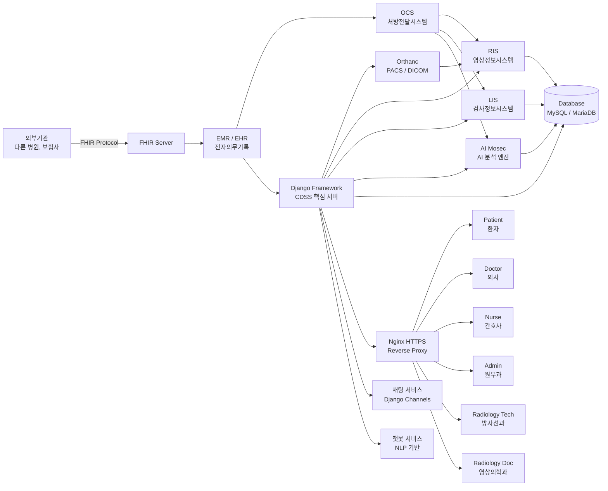
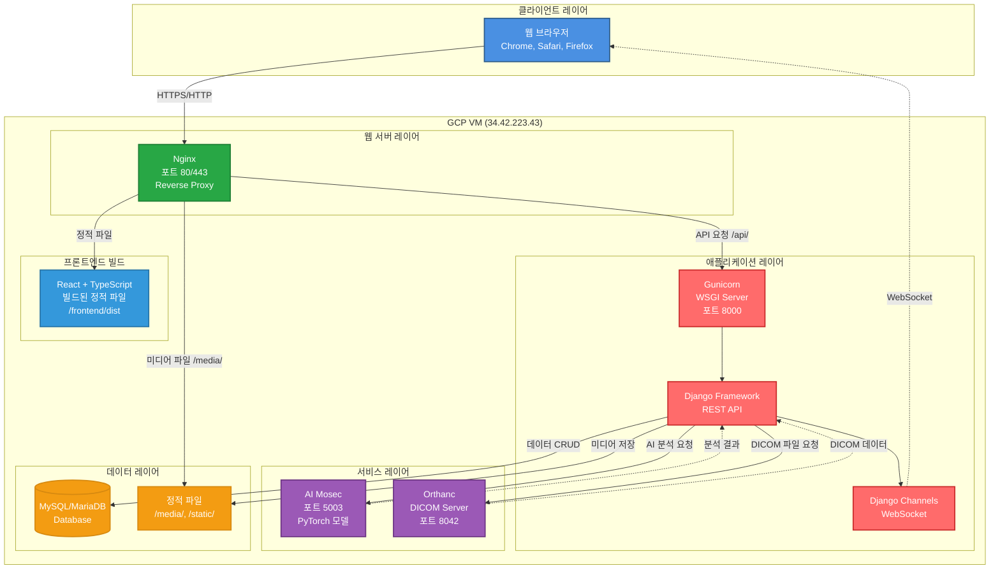
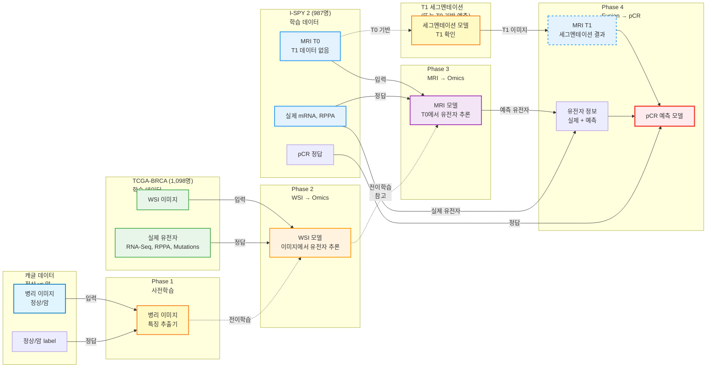

# CDSS 프로젝트 기획 발표 슬라이드 구성안

## 슬라이드 1: 표지
**제목:** CDSS (차세대 지능형 의료지원 시스템)
**부제:** Microservices Architecture 기반 의료 정보 시스템
**팀명/발표자명**
**날짜**

---

## 슬라이드 2: 목차
1. 프로젝트 개요
2. 프로젝트 배경 및 문제 정의
3. 시스템 개요
4. 사용자 역할 정의
5. 시스템 아키텍처
6. 핵심 혁신 - 멀티모달 AI 분석 ⭐
7. 핵심 의료 정보 시스템 (OCS/RIS/LIS)
8. 기술 스택
9. 개발 일정 및 마일스톤
10. 주요 고려사항 및 도전 과제
11. 기대 효과

---

## 슬라이드 3: 프로젝트 개요
**프로젝트명:** CDSS (Clinical Decision Support System)
- 차세대 지능형 의료지원 시스템
- MSA (Microservices Architecture) 기반

**핵심 목표:**
- AI 기반 진단 지원
- 역할별 맞춤형 인터페이스
- 실시간 의료 데이터 관리
- 의료진과 환자를 위한 통합 시스템

**프로젝트 기간:** 약 5-6주

---

## 슬라이드 4: 프로젝트 배경 및 문제 정의
**현재 의료 시스템의 문제점:**
- ❌ **의료진 업무 과부하**: 진단 시간 부족, 업무 효율성 저하
- ❌ **데이터 분산 관리**: EMR, OCS, RIS, LIS, PACS 시스템 간 연동 부족
- ❌ **주관적 진단**: 의료진 경험에 의존한 진단, 일관성 부족
- ❌ **조기 진단의 어려움**: 환자 접근성 제한, 스크리닝 기회 부족

**우리 프로젝트의 해결 방안:**
- ✅ **AI 기반 진단 지원**: 멀티모달 AI 분석으로 정확도 향상
- ✅ **통합 의료 정보 시스템**: EMR, OCS, RIS, LIS, PACS 통합 관리
- ✅ **객관적 진단 기준**: AI 분석 결과 기반 일관된 진단 지원
- ✅ **역할별 맞춤형 인터페이스**: 6가지 역할별 최적화된 시스템

**프로젝트 목적:**
- 의료진의 정확하고 신속한 진단 지원 (AI 분석)
- 환자 치료의 질과 안전성 향상
- 의료 생태계 내 협업 촉진 (실시간 채팅, 데이터 공유)
- 의료 서비스 효율성 향상 (자동화, 통합 관리)

---

## 슬라이드 5: 시스템 범위
**병원 홈페이지 (Public)**
- 일반 사용자 및 환자용 공개 웹사이트
- 환자 회원가입/로그인
- 본인 정보 조회, 진료 기록, 의료 이미지 조회
- 예약 관리, 챗봇 문의

**의료진 플랫폼 (CDSS)**
- 의료진 전용 내부 시스템
- 6가지 역할별 독립 인터페이스
- 마이크로서비스 기반 아키텍처

---

## 슬라이드 6: 사용자 역할 (1/2)
**총 6가지 역할**

1. **의사 (Doctor)**
   - 5개 진료과: 폐-호흡기내과, 머리-신경외과, 유방-유방외과, 췌장-소화기내과, 피부-피부과
   - 진단 및 치료 결정
   - AI 분석 결과 기반 진단 지원

2. **간호사 (Nurse)**
   - 환자 간호 및 의료진 보조
   - 투약 관리, 활력징후 측정
   - 간호 기록 작성

3. **원무과 (Administrative Staff)**
   - 환자 접수 및 등록
   - 예약 관리 (생성, 조회, 수정, 취소)
   - 수납 처리, 보험 처리

---

## 슬라이드 7: 사용자 역할 (2/2)
4. **환자 (Patient)**
   - 본인 의료 정보 조회
   - 예약 신청 및 조회
   - 진료 기록 및 처방전 확인
   - 의료 이미지 및 AI 분석 결과 확인

5. **방사선과 (Radiology Technician)**
   - 의료 이미지 촬영
   - 이미지 업로드 및 메타데이터 입력
   - 촬영 스케줄 관리

6. **영상의학과 (Radiology Doctor)**
   - 의료 이미지 판독
   - AI 분석 실행
   - 판독서 작성
   - 3D 시각화 생성

---

## 슬라이드 8: 시스템 아키텍처 다이어그램
**Mermaid 다이어그램 코드:**


---

## 슬라이드 9: 핵심 의료 정보 시스템
**OCS (처방전달시스템)**
- 처방/검사/영상촬영 주문 생성
- 약국/검사실/영상의학과로 자동 전달
- 주문 상태 추적 및 관리

**RIS (영상정보시스템)**
- 촬영 스케줄 관리
- 판독서 작성 및 관리
- Orthanc (DICOM 서버) 연동

**LIS (검사정보시스템)**
- 검사 주문 관리
- 검사 결과 입력 및 조회
- 이상 결과 알림

**Orthanc (DICOM 서버)**
- DICOM 표준 기반 영상 저장 및 관리
- RESTful API 제공

---

## 슬라이드 10: 데이터베이스 설계 ER 다이어그램

**Mermaid ER 다이어그램 코드:**

```mermaid
erDiagram
    %% 기존 테이블 (회색)
    auth_user ||--o{ Doctor : "1:1"
    auth_user ||--o{ Nurse : "1:1"
    auth_user ||--o{ AdministrativeStaff : "1:1"
    auth_user ||--o{ RadiologyTechnician : "1:1"
    auth_user ||--o{ RadiologyDoctor : "1:1"
    auth_user ||--o{ medical_record : "의사"
    auth_user ||--o{ patients_appointment : "의사"
    auth_user ||--o{ ActivityLog : "사용자"
    auth_user ||--o{ Notification : "사용자"
    auth_user ||--o{ ChatRoomMember : "멤버"
    auth_user ||--o{ ChatMessage : "발신자"
    auth_user ||--o{ ChatBotConversation : "사용자"
    
    patient_user ||--o| patients_patient : "1:1"
    
    patients_patient ||--o{ patients_appointment : "환자"
    patients_patient ||--o{ medical_record : "환자"
    patients_patient ||--o{ medical_images_medicalimage : "환자"
    patients_patient ||--o{ lung_record : "환자"
    patients_patient ||--o{ Prescription : "환자"
    patients_patient ||--o{ NursingRecord : "환자"
    patients_patient ||--o{ PatientStatus : "환자"
    patients_patient ||--o{ RadiologyReport : "환자"
    patients_patient ||--o{ ChatRoom : "진료상담"
    
    patients_appointment ||--o{ ChatRoom : "예약"
    
    medical_record ||--o{ Prescription : "진료기록"
    
    medical_images_medicalimage ||--o{ medical_images_aianalysisresult : "이미지"
    medical_images_medicalimage ||--o{ RadiologyReport : "이미지"
    medical_images_medicalimage ||--o{ ChatMessage : "공유"
    
    lung_record ||--|| lung_result : "1:1"
    
    %% 새로 추가할 테이블 (색상)
    Doctor ||--o{ medical_images_medicalimage : "의뢰"
    Doctor ||--o{ Prescription : "처방"
    
    RadiologyTechnician ||--o{ medical_images_medicalimage : "촬영"
    RadiologyDoctor ||--o{ RadiologyReport : "판독"
    
    Nurse ||--o{ NursingRecord : "간호기록"
    
    ChatRoom ||--o{ ChatRoomMember : "멤버"
    ChatRoom ||--o{ ChatMessage : "메시지"
    
    ChatBotConversation ||--o{ ChatBotMessage : "메시지"
    
    %% 테이블 정의
    auth_user {
        int id PK
        string username
        string email
        string password
        string role
    }
    
    patient_user {
        int id PK
        string account_id
        string email
        string name
        string patient_id
    }
    
    patients_patient {
        int id PK
        string patient_id
        string name
        date birth_date
        string gender
        int age
        string blood_type
        int user_account_id FK
    }
    
    patients_appointment {
        int id PK
        int patient_id FK
        int doctor_id FK
        string doctor_department
        datetime start_time
        datetime end_time
        string status
    }
    
    medical_record {
        int id PK
        int patient_fk_id FK
        int doctor_fk_id FK
        string department
        string status
        text notes
    }
    
    medical_images_medicalimage {
        int id PK
        string patient_id
        string image_type
        string image_file
        int taken_by FK
        int requested_by FK
        string department
        string status
    }
    
    medical_images_aianalysisresult {
        int id PK
        int image_id FK
        string analysis_type
        json results
        float confidence
    }
    
    lung_record {
        int id PK
        int patient_fk_id FK
    }
    
    lung_result {
        int id PK
        int lung_record_id FK
    }
    
    Doctor {
        int id PK
        int user_id FK
        string doctor_id
        string name
        string department
        string license_number
    }
    
    Nurse {
        int id PK
        int user_id FK
        string nurse_id
        string name
        string department
    }
    
    AdministrativeStaff {
        int id PK
        int user_id FK
        string staff_id
        string name
    }
    
    RadiologyTechnician {
        int id PK
        int user_id FK
        string technician_id
        string name
    }
    
    RadiologyDoctor {
        int id PK
        int user_id FK
        string doctor_id
        string name
    }
    
    RadiologyReport {
        int id PK
        int image_id FK
        int patient_id FK
        int radiologist_id FK
        text report_content
        text findings
    }
    
    Prescription {
        int id PK
        int medical_record_id FK
        int patient_id FK
        int doctor_id FK
        json medications
        date prescription_date
    }
    
    NursingRecord {
        int id PK
        int patient_id FK
        int nurse_id FK
        json vital_signs
        text nursing_notes
    }
    
    PatientStatus {
        int id PK
        int patient_id FK
        string status
        string room_number
    }
    
    ChatRoom {
        int id PK
        string room_type
        string name
        int created_by FK
        int related_patient_id FK
        int related_appointment_id FK
    }
    
    ChatRoomMember {
        int id PK
        int room_id FK
        int user_id FK
        string role
    }
    
    ChatMessage {
        int id PK
        int room_id FK
        int sender_id FK
        string message_type
        text content
        int related_image_id FK
    }
    
    ChatBotConversation {
        int id PK
        int user_id FK
        string bot_type
        string session_id
    }
    
    ChatBotMessage {
        int id PK
        int conversation_id FK
        string message_type
        text content
    }
    
    ActivityLog {
        int id PK
        int user_id FK
        string action_type
        string resource_type
    }
    
    Notification {
        int id PK
        int user_id FK
        string notification_type
        string title
        text message
        boolean is_read
    }
```


**테이블 분류:**

**기존 테이블 (9개) - 유지:**
- `auth_user`, `patient_user` (사용자 인증)
- `patients_patient`, `patients_appointment` (환자/예약)
- `medical_record` (진료 기록)
- `lung_record`, `lung_result` (폐암 검사)
- `medical_images_medicalimage`, `medical_images_aianalysisresult` (의료 이미지)

**새로 추가할 테이블 (15개):**
- **의료진 역할**: `Doctor`, `Nurse`, `AdministrativeStaff`, `RadiologyTechnician`, `RadiologyDoctor`
- **진료 관련**: `RadiologyReport`, `Prescription`, `NursingRecord`, `PatientStatus`
- **채팅/챗봇**: `ChatRoom`, `ChatRoomMember`, `ChatMessage`, `ChatBotConversation`, `ChatBotMessage`
- **시스템**: `ActivityLog`, `Notification`

**전략:** 기존 데이터 유지하며 확장

---

## 슬라이드 11: 핵심 혁신 - 멀티모달 AI 분석 시스템 ⭐
**프로젝트의 핵심 차별점: 멀티모달 AI 통합 진단**

### 유방암 3단계 통합 진단 프로세스 (핵심 사례)

**1차 검진: 유방 초음파 (2D 딥러닝)**
- 초기 병변 탐지 및 정밀 진단
- 2D 이미지 처리, 조기 발견
- 3개 클래스 분류: 정상, 양성, 악성

**2차 검진: 조직 검사/병리 이미지 (2D 딥러닝)**
- 현미경 이미지 분석
- 최종 암 확진
- 2D 병리 이미지 처리

**3차 검진: 유방 MRI (3D 딥러닝, DICOM)**
- **사용 시점:** 암 확진 후 수술 전 정밀 평가
- **목적:** 암의 크기 및 범위 평가, 다발성 암 확인
- **데이터 형식:** DICOM 파일 (Orthanc 서버 활용)
- **처리 방식:** 3D 볼륨 데이터 세그멘테이션 및 분류

**→ 3단계 통합 분석으로 정확도 극대화**

### 진료과별 특화 AI 분석

**폐-호흡기내과**: 폐 CT 분석 (폐 결절 탐지)
**머리-신경외과**: 뇌 CT/MRI 분석 (뇌종양 탐지)
**췌장-소화기내과**: 췌장 CT/MRI 분석 (췌장 병변 탐지)
**피부-피부과**: 피부암 분류, 병변 탐지

**AI 서비스:** Mosec 프레임워크, PyTorch 모델 (UNet, ResNet50)

---

## 슬라이드 11-2: 현재 프로젝트 모델 학습 전략

### 1단계: 현재 프로젝트 모델 (5-6주 개발 기간)
**모델 1: 초음파 분석 모델 (1차 검진)**
- **데이터:** 초음파 이미지 (정상/양성/악성 3개 클래스)
- **입력:** 초음파 이미지
- **출력:** 정상, 양성, 악성 확률 (3개 클래스 분류)
- **모델:** 2D 딥러닝 모델 (ResNet50 등)
- **목표:** 초기 병변 탐지 및 정밀 진단
- **용도:** 슬라이드 11의 1차 검진 모델

**모델 2: 병리 이미지 분류 모델 (2차 검진)**
- **데이터:** 캐글 데이터 (정상 vs 암)
- **입력:** 병리 이미지 (정상/암)
- **출력:** 정상, 암 확률
- **모델:** ResNet50 (2D 분류)
- **목표:** 최종 암 확진
- **용도:** 슬라이드 11의 2차 검진 모델

**모델 3: MRI 분석 모델 (3차 검진)**
- **데이터:** MRI DICOM 파일 (별도 수집 필요)
- **입력:** MRI DICOM (3D 볼륨)
- **출력:** 세그멘테이션 + 분류 결과
- **모델:** UNet (세그멘테이션) + ResNet50 (분류)
- **목표:** 암의 크기 및 범위 평가, 다발성 암 확인
- **용도:** 슬라이드 11의 3차 검진 모델

### 2단계: 향후 확장 모델 (연구 단계)

**모델 4: WSI → Omics 예측 모델 (Phase 2)**
- **데이터:** TCGA-BRCA (1,098명, 암 환자만)
  - WSI (H&E 병리 이미지)
  - RNA-Seq (20개 유전자)
  - RPPA (139개 단백질)
  - Mutations (TP53, PIK3CA)
- **입력:** WSI 이미지
- **출력:** 유전자/단백질 정보 예측
- **모델:** ResNet50 (특징 추출기: Phase 1 활용) + 오믹스 예측 헤드
- **목표:** WSI 이미지만 보고도 유전자 정보 추론
- **전이학습:** Phase 1 모델 활용

**모델 5: MRI → Omics 예측 모델 (Phase 3)**
- **데이터:** I-SPY 2 (987명, 항암치료 환자)
  - MRI T0 (Baseline, 치료 전) - **실제 데이터 있음**
  - MRI T1 (3주 후) - **데이터 없음, 세그멘테이션으로 확인 필요**
  - mRNA (20개 유전자)
  - RPPA (139개 단백질)
- **입력:** MRI T0 이미지 (T1 데이터 없음)
- **출력:** 유전자/단백질 정보 예측
- **모델:** 독립 학습 (또는 Phase 2의 오믹스 예측 헤드 참고)
- **목표:** MRI T0 이미지만 보고도 유전자 정보 추론
- **제약사항:** T1 데이터가 없어 T0 데이터로만 학습

**모델 6: pCR 예측 모델 (Phase 4)**
- **데이터:** I-SPY 2 (987명, 항암치료 환자)
  - MRI T1 (치료 3주 후, 중간 시점) - **세그멘테이션 결과로 확인**
  - 유전자 정보 (실제 + 예측)
  - pCR label (정답 데이터) - 치료 완료 후 최종 결과
- **입력:** 
  - MRI T1 (세그멘테이션 결과로 확인된 이미지 또는 T0 기반 예측)
  - 유전자 정보 (실제 데이터 + Phase 3에서 예측한 정보)
- **출력:** pCR 예측 (완전관해 여부)
- **모델:** 융합 모델 (Multi-modal Fusion)
- **목표:** 치료 중간 시점(T1, 3주 후)의 이미지로 최종 결과(pCR)를 조기 예측
- **임상적 의미:** 예후 예측 모델 (진단 모델 아님)
- **핵심 가치:** 치료 완료 전에 치료 반응을 예측하여 치료 전략 조정 가능
- **제약사항 및 대안:** T1 데이터가 없으므로 세그멘테이션 모델로 T1 확인 또는 T0 기반 예측 활용

### 전체 모델 학습 전략 요약

| 모델 | 데이터셋 | 입력 | 출력 | 목표 | 단계 |
|------|---------|------|------|------|------|
| **모델 1** | 초음파 이미지 (정상/양성/악성) | 초음파 이미지 | 정상/양성/악성 확률 | 초기 병변 탐지 | 현재 |
| **모델 2** | 캐글 데이터 (정상/암) | 병리 이미지 | 정상/암 확률 | 최종 암 확진 | 현재 |
| **모델 3** | MRI DICOM | MRI 3D 볼륨 | 세그멘테이션 + 분류 | 암 범위 평가 | 현재 |
| **모델 4** | TCGA-BRCA (WSI + 오믹스) | WSI 이미지 | 유전자/단백질 예측 | 이미지→오믹스 추론 | 향후 확장 |
| **모델 5** | I-SPY 2 (MRI + 오믹스) | MRI T0 (T1 데이터 없음) | 유전자/단백질 예측 | 이미지→오믹스 추론 | 향후 확장 |
| **모델 6** | I-SPY 2 (MRI + 유전자 + pCR) | MRI T1 (세그멘테이션) + 유전자 | pCR 예측 | 치료 반응 예측 | 향후 확장 |

### 데이터 활용 요약

**현재 프로젝트 모델:**
| 데이터셋 | 용도 | 모델 | 단계 |
|---------|------|------|------|
| **초음파 이미지** (정상/양성/악성) | 현재 프로젝트 1차 검진 | 초음파 분석 모델 (3클래스 분류) | 현재 |
| **캐글 데이터** (정상/암) | 현재 프로젝트 2차 검진 | 병리 이미지 분류 모델 | 현재 |
| **MRI DICOM** | 현재 프로젝트 3차 검진 | MRI 분석 모델 | 현재 |

**향후 확장 모델:**
| 데이터셋 | 용도 | 모델 | 단계 |
|---------|------|------|------|
| **캐글 데이터** (정상/암) | Phase 1 사전학습 | 특징 추출기 학습 | 향후 확장 |
| **TCGA-BRCA** (암 환자만) | Phase 2 학습 | WSI → Omics 모델 | 향후 확장 |
| **I-SPY 2** (항암치료 환자) | Phase 3, 4 학습 | MRI → Omics, pCR 예측 | 향후 확장 |

---

## 슬라이드 12: OCS 전달 흐름
```
의사 (진료 중)
    ↓
처방/검사/영상 주문 입력
    ↓
OCS 시스템
    ├─ 주문 정보 저장 (Database)
    ├─ 주문 검증 (약물 상호작용, 알레르기 체크)
    └─ 주문 전달
        ├─ 처방전 → 약국 시스템
        ├─ 검사 주문 → LIS (검사실)
        └─ 영상 의뢰 → RIS (방사선과)
    ↓
각 부서 처리 → 상태 업데이트 → 결과 전달
```

**전달 형태:**
- JSON 형식의 구조화된 주문 정보
- RESTful API 또는 메시지 큐
- WebSocket 실시간 알림

---

## 슬라이드 13: 채팅 및 챗봇 기능
**채팅 서비스 (Django Channels)**
- 의료진 간 실시간 채팅
- 환자와의 진료 상담 채팅
- 의료 이미지 및 진료 기록 공유
- 그룹 채팅 (진료팀)

**챗봇 서비스 (NLP 기반)**
- 영상 판독 챗봇 (영상의학과용)
  - DICOM 표준 질의응답
  - 판독서 작성 도움
- 병원 홈페이지 챗봇
  - 일반 문의, 예약 안내

---

## 슬라이드 14: 프론트엔드 구조
**병원 홈페이지 (Public)**
- 경로: `/` (공개 페이지)
- 환자 인터페이스: `/patient/*`
  - 본인 정보 조회, 진료 기록, 의료 이미지
  - 예약 관리, 챗봇 문의

**의료진 플랫폼 (CDSS)**
- 의사: `/doctor/*`
- 간호사: `/nurse/*`
- 원무과: `/admin/*`
- 방사선과: `/radiology-tech/*`
- 영상의학과: `/radiology-doctor/*`

**기술:** React + TypeScript, 기존 디자인 시스템 재사용

---

## 슬라이드 15: 기술 스택 아키텍처 다이어그램

**Mermaid 다이어그램 코드:**


**주요 구성 요소:**

**웹 서버 레이어:**
- Nginx: 리버스 프록시, 정적 파일 서빙, SSL/TLS 처리
- 포트: 80 (HTTP), 443 (HTTPS)

**애플리케이션 레이어:**
- Gunicorn: Django WSGI 서버 (포트 8000)
- Django Framework: REST API, 비즈니스 로직
- Django Channels: WebSocket 실시간 통신

**서비스 레이어:**
- AI Mosec: AI 모델 서빙 (포트 5003)
- Orthanc: DICOM 서버 (포트 8042)

**데이터 레이어:**
- MySQL/MariaDB: 관계형 데이터베이스
- 정적 파일: 미디어 파일, 정적 리소스

**프론트엔드:**
- React + TypeScript: 빌드된 정적 파일 (SPA)

---

## 슬라이드 15-2: 기술 스택 상세
**프론트엔드:**
- React + TypeScript
- TanStack Query, React Router
- shadcn/ui, Plotly (3D 시각화)

**백엔드:**
- Django + Django REST Framework
- Django Channels (WebSocket)
- JWT 인증

**AI/ML:**
- Mosec (AI 서비스 프레임워크)
- PyTorch (UNet, ResNet50)

**인프라:**
- GCP VM (http://34.42.223.43/)
- Nginx, Gunicorn
- MySQL/MariaDB

---

## 슬라이드 16: 보안 및 권한 관리
**인증 방식:**
- JWT (JSON Web Token)
- Refresh Token 구현

**권한 관리:**
- 역할 기반 접근 제어 (RBAC)
- 리소스별 권한 체크

**데이터 접근 제어:**
- 환자 데이터: 본인 또는 담당 의료진만 접근
- 의료 이미지: 역할별 접근 권한 분리
- 진료 기록: 담당 의사 및 환자 본인만 접근

**시스템 접근 제어:**
- 병원 홈페이지: 공개 접근 (환자 회원가입 가능)
- 의료진 플랫폼: 의료진 전용 (환자 접근 불가)

---

## 슬라이드 17: 개발 일정 및 마일스톤
| 단계 | 기간 | 주요 작업 | 마일스톤 |
|------|------|----------|---------|
| **Phase 1: 기반 구축** | 1주 | DB 스키마 설계 및 구현<br/>사용자 인증 시스템<br/>기본 API 엔드포인트 | ✅ 인증 시스템 완료<br/>✅ DB 스키마 확정 |
| **Phase 2: 역할별 홈페이지** | 2주 | 병원 홈페이지 (공개)<br/>의료진 플랫폼 접근 통합<br/>6가지 역할별 프론트엔드 개발 | ✅ 6가지 역할별 UI 완성<br/>✅ 기본 CRUD 기능 구현 |
| **Phase 3: 핵심 기능** | 1.5주 | 의료 이미지 관리<br/>AI 분석 연동<br/>진료 기록, 예약 시스템 | ✅ AI 분석 파이프라인 구축<br/>✅ OCS/RIS/LIS 기본 기능 |
| **Phase 4: 고급 기능** | 1주 | 3D 시각화<br/>채팅/챗봇 기능<br/>알림 시스템 | ✅ 3D 시각화 구현<br/>✅ 실시간 채팅 기능 |
| **Phase 5: 테스트 및 배포** | 0.5주 | 통합 테스트<br/>최적화, 배포 | ✅ 프로덕션 배포 완료 |

**총 예상 기간: 5-6주**

**현재 진행 상황:**
- ✅ 기존 시스템 기반 구축 (DB, 인증 시스템 일부 완료)
- ✅ 의료 이미지 관리 시스템 기본 구조 완성
- 🔄 AI 분석 서비스 연동 진행 중

---

## 슬라이드 18: 주요 고려사항 및 도전 과제
**보안 (의료법 준수):**
- 개인정보 보호 (의료법, 개인정보보호법)
- 데이터 암호화 (전송/저장)
- 접근 로그 관리 및 감사(audit)
- 역할 기반 접근 제어 (RBAC)

**성능 최적화:**
- 이미지 로딩 최적화 (캐싱, 압축)
- AI 분석 비동기 처리 (Mosec 활용)
- 데이터베이스 쿼리 최적화
- 3D DICOM 데이터 처리 최적화

**확장성:**
- 마이크로서비스 독립 배포
- 수평 확장 가능한 구조
- 모니터링 및 로깅 시스템

**기술적 도전 과제:**
- 🔸 멀티모달 데이터 통합 (2D + 3D)
- 🔸 DICOM 표준 준수 및 Orthanc 연동
- 🔸 실시간 AI 추론 성능 최적화
- 🔸 대용량 의료 이미지 관리

---

## 슬라이드 19: 기대 효과

### 의료진 관점
**진단 정확도 향상**
- ✅ 멀티모달 AI 분석으로 진단 정확도 향상
- ✅ 3단계 통합 진단 프로세스 (초음파 → 병리 → MRI)
- ✅ 객관적 진단 기준 제공

**업무 효율성 향상**
- ✅ 자동화된 처방전달시스템 (OCS)
- ✅ 실시간 채팅으로 협업 시간 단축
- ✅ 역할별 맞춤형 인터페이스로 업무 흐름 최적화
- ✅ 통합 시스템으로 데이터 검색 시간 감소

**의료진 간 협업 강화**
- ✅ 실시간 채팅 및 의료 이미지 공유
- ✅ 그룹 채팅을 통한 진료팀 협업
- ✅ 판독서 및 진료 기록 실시간 공유

### 환자 관점
**치료의 질과 안전성 향상**
- ✅ AI 기반 정확한 진단으로 치료 효과 향상
- ✅ 약물 상호작용, 알레르기 자동 체크
- ✅ 지속적인 치료 지원 및 모니터링

**편의성 향상**
- ✅ 온라인 예약 및 진료 기록 조회
- ✅ 의료 이미지 및 AI 분석 결과 확인
- ✅ 진료 기록 및 처방전 디지털 관리

### 병원 관점
**의료 서비스 효율성 향상**
- ✅ 시스템 간 통합으로 업무 프로세스 자동화
- ✅ 데이터 기반 의사결정 지원
- ✅ 의료 정보 디지털화로 문서 관리 효율화

**운영 비용 절감**
- ✅ 통합 시스템으로 중복 작업 감소
- ✅ 자동화로 인력 효율성 향상
- ✅ 데이터 기반 운영 최적화

**확장성 및 미래 대비**
- ✅ 마이크로서비스 아키텍처로 유연한 확장
- ✅ FHIR 표준 준수로 외부 시스템 연동 용이
- ✅ AI 모델 추가 및 업데이트 용이

---

## 슬라이드 20: 향후 확장 계획 - 오믹스 데이터 통합 멀티모달 AI ⭐

### 목표
**유방암 치료 반응(pCR) 예측을 위한 멀티모달 AI 모델 개발**

> **중요:** 이 모델은 진단(diagnosis)이 아닌 **예후 예측(prognosis)** 모델입니다.
> - 암이 이미 확진된 환자들의 치료 반응을 예측
> - 항암치료 후 완전관해(pCR) 여부를 조기 예측

**데이터셋:**
- **TCGA-BRCA**: 1,098명 (암 확진 환자 데이터)
  - WSI (H&E 병리 이미지) - 암 조직 이미지
  - RNA-Seq (20개 유전자)
  - RPPA (139개 단백질)
  - Mutations (TP53, PIK3CA)
  - **용도:** WSI에서 오믹스 정보 학습 (전이학습 기반 구축)
  
- **I-SPY 2**: 987명 (항암치료 환자 데이터)
  - MRI T0 (Baseline) - 치료 전
  - MRI T1 (3주 후) - 치료 중간
  - mRNA (20개 유전자)
  - RPPA (139개 단백질)
  - pCR label (정답 데이터) - 치료 반응 결과
  - **용도:** 최종 pCR 예측 모델 학습 및 검증

### 파이프라인 핵심 아이디어

**목표:** MRI 이미지만 보고도 유전자 정보를 추론하고, 이를 활용해 치료 반응(pCR)을 예측

**왜 이렇게 하나요?**
- 실제 임상에서는 MRI는 쉽게 얻지만, 유전자 검사는 비용이 많이 듭니다
- MRI 이미지에서 유전자 정보를 추론할 수 있다면, 비용 절감 + 빠른 예측 가능

### 2단계: 향후 확장 모델 학습 전략 (연구 단계)

**Phase 1: 병리 이미지 사전학습 (캐글 데이터 활용)**
```
입력: 병리 이미지 (정상/암)
출력: 정상/암 분류
모델: ResNet50 (특징 추출기 학습)
목적: Phase 2의 사전학습
데이터: 캐글 데이터 (정상 vs 암)
```

**Phase 2: WSI → Omics (TCGA-BRCA 활용)**
```
입력: WSI 이미지 (병리 조직 사진)
출력: 유전자/단백질 정보 예측
모델: 
  - 특징 추출기: Phase 1 모델 활용 (전이학습)
  - 오믹스 예측 헤드: 새로 학습
데이터: TCGA-BRCA (WSI + 실제 오믹스 데이터)
목적: WSI 이미지만 보고도 유전자 정보 추론
```

**Phase 3: MRI → Omics (I-SPY 2 활용)**
```
입력: MRI T0 이미지 (T1 데이터 없음)
출력: 유전자/단백질 정보 예측
모델: 독립 학습 (또는 Phase 2의 오믹스 예측 헤드 참고)
데이터: I-SPY 2 (MRI T0 + 실제 오믹스 데이터)
목적: MRI T0 이미지만 보고도 유전자 정보 추론
제약사항: T1 데이터가 없어 T0 데이터로만 학습
```

**Phase 4: Multi-modal Fusion**
```
입력: 
  - MRI T1 (치료 3주 후, 중간 시점 이미지)
    * 실제 T1 데이터 없음 → 세그멘테이션 모델로 T1 확인 필요
    * 또는 T0 기반으로 T1 예측/추정
  - 유전자 정보 (실제 + 예측)
출력: pCR 예측 (완전관해 여부)
모델: 융합 모델
데이터: I-SPY 2 (pCR label 포함 - 치료 완료 후 최종 결과)
목적: 치료 중간 시점(T1, 3주 후)에서 최종 반응(pCR) 조기 예측
핵심: 치료 완료 전에 치료 반응을 예측하여 치료 전략 조정 가능
제약사항: T1 데이터가 없으므로 세그멘테이션 결과 또는 T0 기반 예측 활용
```

### 향후 확장 모델 데이터 활용 요약

| 데이터셋 | 용도 | 모델 | 단계 |
|---------|------|------|------|
| **캐글 데이터** (정상/암) | Phase 1 사전학습 | 특징 추출기 학습 | 향후 확장 |
| **TCGA-BRCA** (암 환자만) | Phase 2 학습 | WSI → Omics 모델 | 향후 확장 |
| **I-SPY 2** (항암치료 환자) | Phase 3, 4 학습 | MRI → Omics, pCR 예측 | 향후 확장 |

### 4단계 학습 전략 (단계별 설명)

**Phase 1: 병리 이미지 사전학습 (캐글 데이터 활용)**
```
목표: 병리 이미지 특징 추출기 학습

입력: 병리 이미지 (정상/암)
정답: 정상/암 분류
모델: ResNet50 (특징 추출기 학습)

학습 결과: 병리 이미지의 기본 특징을 학습한 모델
→ Phase 2의 사전학습으로 활용
```

**Phase 2: WSI → Omics Learning (TCGA-BRCA 데이터 활용)**
```
목표: 병리 이미지(WSI)만 보고도 유전자/단백질 정보를 추론하는 모델 학습

입력: WSI 이미지 (병리 조직 사진)
정답: 실제 유전자(RNA-Seq), 단백질(RPPA), 돌연변이(Mutations) 데이터
전이학습: Phase 1의 특징 추출기 활용

학습 결과: WSI 이미지를 보면 → 유전자 정보를 예측할 수 있는 모델
```

**Phase 3: MRI → Omics Learning (I-SPY 2 데이터 활용)**
```
목표: MRI 이미지만 보고도 유전자/단백질 정보를 추론하는 모델 학습

입력: MRI T0 이미지 (T1 데이터 없음)
정답: 실제 mRNA, RPPA 데이터

제약사항:
- T1 데이터가 없어 T0 데이터로만 학습
- T1은 세그멘테이션 결과로 확인하거나 T0 기반으로 예측

전이학습 전략:
- WSI와 MRI는 다른 모달리티이므로, 모델 구조는 다르게 학습
- 하지만 "이미지 → 오믹스 정보" 예측이라는 공통 목표가 있음
- Phase 2에서 학습한 "어떤 이미지 특징이 유전자와 연관되는가"에 대한 
  지식을 참고하여 초기 가중치 설정 (선택 사항)
- 또는 독립적으로 학습 후 Phase 4에서 융합

학습 결과: MRI T0 이미지를 보면 → 유전자 정보를 예측할 수 있는 모델
```

**Phase 4: Multi-modal Fusion (I-SPY 2 데이터 활용)**
```
목표: MRI + 유전자 정보를 합쳐서 치료 반응(pCR) 예측

입력: 
  - MRI T1 (치료 3주 후, 중간 시점 이미지)
    * 실제 T1 데이터 없음
    * 세그멘테이션 모델로 T1 확인 또는 T0 기반 예측 활용
  - 유전자 정보 (실제 데이터 + Phase 3에서 예측한 정보)
정답: pCR (완전관해 여부) - 치료 완료 후 최종 결과

제약사항 및 대안:
- T1 데이터가 없으므로 세그멘테이션 모델로 T1 확인
- 또는 T0 기반으로 T1 변화 예측
- 또는 T0 데이터만으로 pCR 예측 (성능 저하 가능)

핵심 아이디어:
- 치료 중간 시점(T1, 3주 후)의 이미지로 최종 결과(pCR)를 조기 예측
- 치료 완료 전에 치료 반응을 예측하여 치료 전략 조정 가능

학습 결과: 치료 중간 시점에서 최종 반응을 예측하는 모델
```

### 4단계 학습 전략 다이어그램 (향후 확장)

**Mermaid 다이어그램 코드:**


### 전이학습 전략 상세 설명

**WSI와 MRI의 차이점:**
- WSI: 병리 조직 이미지 (현미경 수준, 고해상도)
- MRI: 의료 영상 (전체 유방, 3D 볼륨)
- **완전히 다른 모달리티**이므로 모델 구조가 다를 수 있음

**전이학습 가능한 부분:**
1. **오믹스 예측 헤드 (Omics Prediction Head)**
   - "이미지 특징 → 유전자 정보" 매핑 방법
   - Phase 2에서 학습한 가중치를 초기값으로 활용 가능

2. **공통 특징 추출 (Common Feature Extraction)**
   - 이미지에서 유전자와 연관된 패턴을 찾는 방법
   - WSI에서 학습한 지식을 참고하여 초기화

3. **독립 학습 후 융합 (대안)**
   - Phase 2와 Phase 3를 완전히 독립적으로 학습
   - Phase 4에서 두 모델의 출력을 융합

**권장 접근법:**
- Phase 2: WSI → Omics 모델 독립 학습
- Phase 3: MRI → Omics 모델 독립 학습 (또는 Phase 2의 오믹스 예측 헤드 참고)
- Phase 4: MRI 모델 출력 + 실제 유전자 데이터 융합 → pCR 예측

### 실제 사용 시나리오

**임상 현장에서 (실제 상황 반영):**
1. 환자가 항암치료를 받음
2. 치료 전 MRI 촬영 (T0) - **실제 데이터 있음**
3. **Phase 3 모델**: MRI T0만 보고 유전자 정보 예측
4. **T1 확인**: 세그멘테이션 모델로 T1 확인 또는 T0 기반 예측
   - 실제 T1 데이터가 없으므로 세그멘테이션 결과 활용
   - 또는 T0 기반으로 T1 변화 예측
5. **Phase 4 모델**: MRI T1 (세그멘테이션 결과) + 예측 유전자 정보 → pCR 예측
6. 의사가 **치료 완료 전에** 치료 반응을 조기 예측하여 치료 전략 조정
   - pCR 가능성이 낮으면 치료 변경
   - pCR 가능성이 높으면 현재 치료 계속

**핵심 가치:**
- ✅ 치료 전 시점(T0) 이미지로 최종 결과(pCR) 예측 시도
- ✅ T1 데이터 부재 시 세그멘테이션 또는 T0 기반 예측 활용
- ✅ 치료 완료 전에 치료 반응 조기 예측 가능
- ✅ 비효과적인 치료 조기 중단 및 치료 전략 변경 지원

**제약사항 및 대안:**
- ⚠️ T1 데이터가 없어 T0 데이터로만 학습
- ✅ 세그멘테이션 모델로 T1 확인 또는 T0 기반 예측 활용
- ✅ 실제 T1 데이터 확보 시 모델 성능 향상 가능

**장점:**
- ✅ 유전자 검사 없이도 빠른 예측 가능
- ✅ 비용 절감 (유전자 검사는 비쌈)
- ✅ 치료 중간 시점에서 조기 예측

**모델의 임상적 의미:**
- ✅ **진단 모델이 아님**: 이미 암이 확진된 환자 대상
- ✅ **예후 예측 모델**: 치료 반응(pCR)을 조기 예측
- ✅ **치료 최적화**: 항암치료 중간 시점에서 치료 효과 예측
- ✅ **맞춤형 치료**: 환자별 유전체 정보 기반 치료 계획 수립

**기대 효과:**
- ✅ 영상 데이터 + 유전체 데이터 통합으로 예측 정확도 향상
- ✅ 치료 중간 시점(T1)에서 최종 반응(pCR) 조기 예측 가능
- ✅ 비효과적인 치료 조기 중단 및 치료 전략 변경 지원

### 추가 기능 확장

**고급 AI 기능:**
- 자동 리포트 생성
- 진단 제안 시스템 고도화
- 예측 분석 기능

**시스템 기능:**
- 고급 챗봇 기능 (LLM 기반)
- 원격 진료 기능
- 웨어러블 기기 연동
- 화상 상담 기능

**시스템 통합:**
- EMR/EHR 시스템 연동
- 외부 의료기관 연동
- FHIR Server 완전 구현

---

## 슬라이드 20-2: 향후 확장 계획 - 추가 기능

**AI 기능 확장:**
- 추가 딥러닝 모델 통합
- 예측 분석 기능
- 자동 리포트 생성
- 진단 제안 시스템 고도화

**시스템 기능:**
- 고급 챗봇 기능 (LLM 기반)
- 원격 진료 기능
- 웨어러블 기기 연동
- 화상 상담 기능

**시스템 통합:**
- EMR/EHR 시스템 연동
- 외부 의료기관 연동
- FHIR Server 완전 구현

---

## 슬라이드 21: 결론

### 프로젝트 핵심 가치

**"차세대 지능형 의료지원 시스템 (CDSS)"**

**혁신적 기술 통합**
- 🚀 멀티모달 AI 분석 (2D + 3D 딥러닝)
- 🚀 마이크로서비스 아키텍처 (MSA)
- 🚀 실시간 협업 시스템 (WebSocket)

**실용적 문제 해결**
- ✅ 의료진 업무 효율성 향상
- ✅ 진단 정확도 개선
- ✅ 환자 중심 의료 서비스 제공

**확장 가능한 구조**
- ✅ 6가지 역할별 맞춤형 인터페이스
- ✅ 5개 진료과별 특화 AI 분석
- ✅ 통합 의료 정보 시스템 (EMR, OCS, RIS, LIS, PACS)

### 프로젝트 요약

**시스템 범위:**
- 병원 홈페이지 (환자용) + 의료진 플랫폼 (CDSS)
- 6가지 사용자 역할 지원
- 5개 진료과별 특화 기능

**핵심 기능:**
- 멀티모달 AI 진단 지원 (초음파, 병리, MRI)
- 통합 의료 정보 시스템 (OCS, RIS, LIS)
- 실시간 채팅 및 챗봇
- 3D 시각화 및 DICOM 처리

**기술 스택:**
- 프론트엔드: React + TypeScript
- 백엔드: Django + Django REST Framework
- AI: Mosec + PyTorch (UNet, ResNet50)
- 인프라: GCP VM + Nginx + Gunicorn

### 기대 성과

**단기 (5-6주 개발 기간)**
- ✅ 통합 의료 정보 시스템 구축
- ✅ 멀티모달 AI 분석 파이프라인 완성
- ✅ 역할별 맞춤형 인터페이스 구현

**중장기 (운영 후)**
- 📈 진단 정확도 향상
- 📈 의료진 업무 효율성 30% 이상 개선
- 📈 환자 만족도 향상
- 📈 병원 운영 비용 절감

---

## 슬라이드 22: Q&A
**감사합니다**

**문의사항이 있으시면 언제든지 질문해주세요.**

---

## 슬라이드 구성 요약

**총 25장 구성 (Flutter 앱 제외 버전)**

1. 표지
2. 목차
3. 프로젝트 개요
4. 프로젝트 배경 및 문제 정의 (개선됨)
5. 시스템 범위
6. 사용자 역할 (1/2)
7. 사용자 역할 (2/2)
8. 시스템 아키텍처 다이어그램
9. 핵심 의료 정보 시스템 (OCS/RIS/LIS)
10. 데이터베이스 설계 ER 다이어그램
11. **핵심 혁신 - 멀티모달 AI 분석** ⭐ (개선됨)
11-2. 현재 프로젝트 모델 학습 전략 (새로 추가)
12. OCS 전달 흐름
13. 채팅 및 챗봇 기능
14. 프론트엔드 구조
15. 기술 스택 아키텍처 다이어그램
15-2. 기술 스택 상세
16. 보안 및 권한 관리
17. 개발 일정 및 마일스톤 (개선됨)
18. 주요 고려사항 및 도전 과제 (개선됨)
19. 기대 효과 (개선됨)
20. 향후 확장 계획 - 오믹스 데이터 통합 멀티모달 AI ⭐
20-2. 향후 확장 계획 - 추가 기능
21. 결론 (새로 추가)
22. Q&A

---

## 발표 시 주의사항

### 시각화 권장사항
1. **슬라이드 8**: 시스템 아키텍처 다이어그램은 Mermaid 코드를 사용하여 시각화
2. **슬라이드 11**: 멀티모달 AI 분석은 3단계 프로세스를 플로우차트로 표현
3. **슬라이드 12**: OCS 전달 흐름은 다이어그램으로 표현하면 더 효과적
4. **슬라이드 15**: 기술 스택 아키텍처는 계층별로 구분하여 시각화
5. **슬라이드 17**: 개발 일정은 간트 차트로 표현 가능
6. **슬라이드 11-2**: 현재 프로젝트 모델 학습 전략은 표 형식으로 정리
7. **슬라이드 20**: 오믹스 데이터 통합 멀티모달 AI는 4단계 학습 전략 다이어그램으로 표현 (Phase 1 포함)

### 발표 전략
5. **슬라이드 4 (문제 정의)**: 문제점을 명확히 제시하여 해결 방안의 필요성 강조
6. **슬라이드 11 (멀티모달 AI)**: 프로젝트의 핵심 차별점이므로 시간을 충분히 할애
7. **슬라이드 19 (기대 효과)**: 의료진/환자/병원 관점으로 구분하여 설명
8. **슬라이드 20 (오믹스 데이터 통합)**: 향후 확장 계획의 핵심이므로 연구적 가치 강조
9. **슬라이드 21 (결론)**: 프로젝트 핵심 가치와 요약을 명확히 전달
9. 각 슬라이드에 적절한 이미지나 아이콘 추가 권장
10. 핵심 내용은 불릿 포인트로 간결하게 정리
11. 발표 시간에 맞춰 슬라이드 수 조정 가능 (15-20분 기준 권장)

### 예상 질문 대비
- **Q: 5-6주로 모든 기능을 구현할 수 있나요?**
  - A: 기존 시스템 기반으로 확장하며, 핵심 기능에 집중하여 구현
  
- **Q: 멀티모달 AI의 성능 향상은 얼마나 되나요?**
  - A: 단일 모달 대비 정확도 향상 기대, 실제 데이터로 검증 예정
  
- **Q: 의료법 준수를 어떻게 보장하나요?**
  - A: RBAC, 접근 로그, 데이터 암호화 등 보안 체계 구축

- **Q: WSI 모델을 MRI 학습에 사용해도 되나요?**
  - A: WSI와 MRI는 다른 모달리티이므로, 모델은 독립적으로 학습하되 "이미지 → 오믹스" 예측이라는 공통 목표를 활용합니다. Phase 2의 오믹스 예측 헤드 부분을 참고하여 초기화하거나, 완전히 독립 학습 후 Phase 4에서 융합하는 방식을 고려할 수 있습니다.

