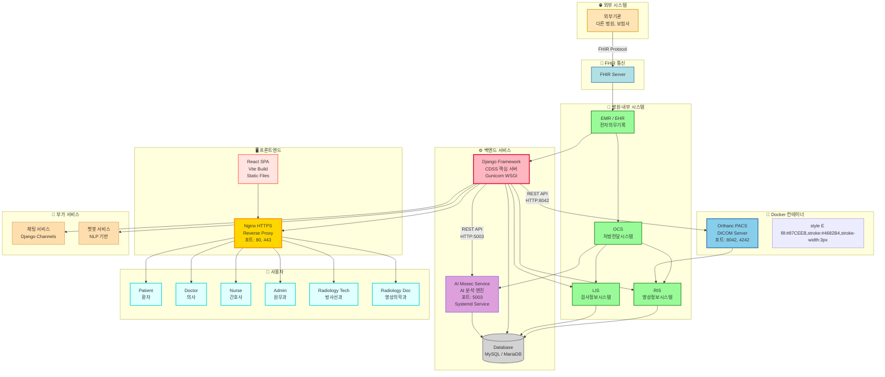

# 🏥 CDSS 프로젝트 전체 아키텍처



## 📋 시스템 구성 요소 설명

### 🐳 Docker 컨테이너

#### Orthanc PACS Server
- **컨테이너 이미지**: `orthancteam/orthanc`
- **포트**: 
  - HTTP: `8042` (REST API, Web UI)
  - DICOM: `4242` (DICOM 통신)
- **기능**: DICOM 파일 저장 및 관리, DICOM 파일 조회/다운로드
- **연결 방식**: Django에서 HTTP REST API로 연결
- **데이터 저장**: Docker 볼륨 마운트 (`/var/lib/orthanc/db`)
- **설정 파일**: `~/orthanc/orthanc.json`

### ⚙️ 백엔드 서비스 (GCP VM 직접 실행)

#### Django Framework (CDSS 핵심 서버)
- **실행 방식**: Gunicorn WSGI Server
- **포트**: Unix Socket 또는 TCP Socket
- **Systemd Service**: `gunicorn.service`
- **기능**: 
  - 환자 정보 관리
  - 의료 이미지 조회/업로드
  - AI 분석 요청/결과 수신
  - 사용자 인증 및 권한 관리
  - REST API 제공
- **연결**: 
  - Orthanc: HTTP REST API (`http://localhost:8042`)
  - AI Mosec: HTTP REST API (`http://localhost:5003`)
  - Database: MySQL/MariaDB

#### AI Mosec Service
- **실행 방식**: Python Mosec Framework (Systemd Service)
- **포트**: `5003`
- **Systemd Service**: `breast-ai-service.service`
- **기능**: 유방 MRI AI 분석 (3D 딥러닝 모델)
- **모델 경로**: `backend/breast_ai_service/ml_model/best_breast_mri_model.pth`

#### Database (MySQL/MariaDB)
- **타입**: 관계형 데이터베이스
- **기능**: 환자 정보, 진료 기록, 예약 정보 등 저장

### 🖥️ 프론트엔드

#### React SPA (Single Page Application)
- **빌드 도구**: Vite
- **배포**: 빌드 후 정적 파일로 Nginx에서 서빙
- **프레임워크**: React + TypeScript
- **주요 라이브러리**: 
  - Cornerstone3D (DICOM 뷰어)
  - React Router (라우팅)
  - Axios (HTTP 클라이언트)

#### Nginx (Reverse Proxy)
- **포트**: `80` (HTTP), `443` (HTTPS)
- **기능**: 
  - 정적 파일 서빙 (React 빌드 파일)
  - Django 백엔드 프록시
  - Orthanc 프록시 (`/orthanc/` 경로)
  - SSL/TLS 인증서 관리
- **설정**: `/etc/nginx/sites-available/default`

### 💬 부가 서비스

#### 채팅 서비스 (Django Channels)
- **프로토콜**: WebSocket
- **기능**: 실시간 채팅, 의료진 간 소통

#### 챗봇 서비스 (NLP 기반)
- **기능**: 자연어 처리 기반 질의응답

## 🔄 데이터 흐름

### 1. 의료 이미지 업로드 플로우
```
방사선과 → Django → Orthanc (Docker)
                      ↓
                  DICOM 저장
```

### 2. 이미지 조회 플로우
```
사용자 → React → Django → Orthanc (Docker)
                              ↓
                         DICOM 파일 반환
                              ↓
                         Cornerstone3D 렌더링
```

### 3. AI 분석 플로우
```
영상의학과 → Django → AI Mosec Service
                            ↓
                      AI 분석 수행
                            ↓
                      결과 반환 → Django → Database 저장
```

### 4. 외부 시스템 연동
```
외부기관 → FHIR Server → EMR/EHR → OCS/RIS/LIS
```

## 🔐 네트워크 구조

```
인터넷
  ↓
Nginx (포트 80/443)
  ├─→ Django (Gunicorn)
  │     ├─→ Orthanc (Docker, 포트 8042)
  │     ├─→ AI Mosec (포트 5003)
  │     └─→ Database
  ├─→ React (Static Files)
  └─→ Orthanc Web UI (/orthanc/ 경로)
```

## 📦 배포 구조 (GCP VM)

```
/var/www/cdss (또는 ~/Django-React--)
├── backend/
│   ├── .venv/              # Python 가상환경
│   ├── manage.py
│   └── ...
├── frontend/
│   ├── dist/               # React 빌드 파일 (Nginx에서 서빙)
│   └── ...
├── orthanc/                # Orthanc Docker 설정
│   └── orthanc.json
└── ...
```

## 🚀 서비스 실행 순서

1. **Database** 시작
2. **Orthanc** Docker 컨테이너 시작 (`docker-compose up -d`)
3. **Django** (Gunicorn) 시작 (`systemctl start gunicorn`)
4. **AI Mosec** 시작 (`systemctl start breast-ai-service`)
5. **Nginx** 시작 (`systemctl start nginx`)

## 🔧 주요 설정 파일

- **Django**: `backend/.env` (환경 변수)
- **Orthanc**: `~/orthanc/orthanc.json`
- **Nginx**: `/etc/nginx/sites-available/default`
- **Gunicorn**: `/etc/systemd/system/gunicorn.service`
- **AI Mosec**: `/etc/systemd/system/breast-ai-service.service`

